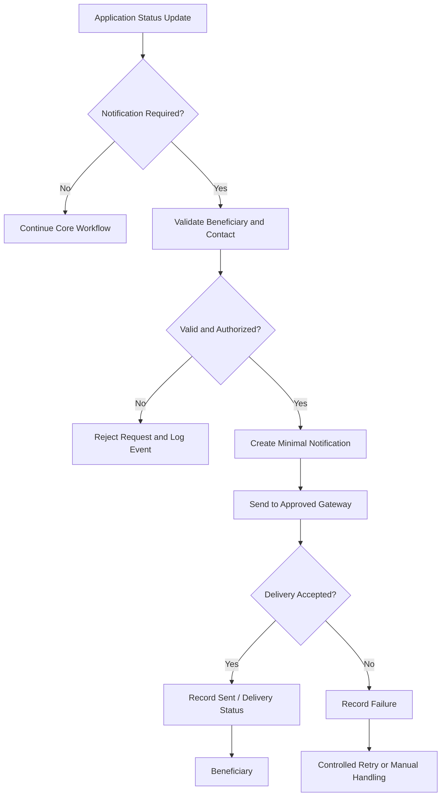

# Proposed Data Flow Diagram

## Data-Minimization Principle

Only information required for the notification should cross the integration boundary. The design should avoid sending unnecessary beneficiary details to the communication provider.
