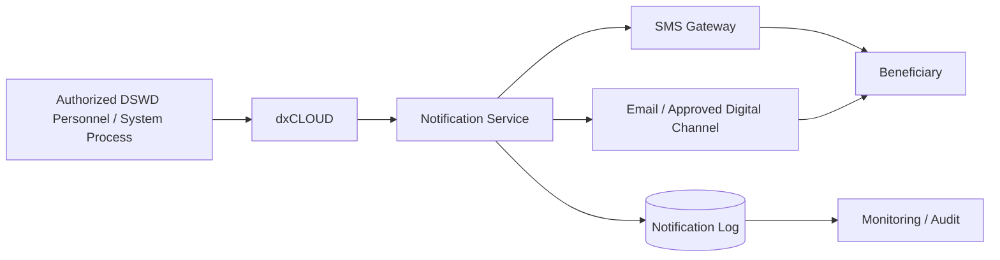

# Proposed System Architecture Diagram

## Notes

- dxCLOUD is the source of authorized application-status information for this academic design.
- The Notification Service is the proposed integration layer.
- Communication providers are external delivery components.
- Notification logs support monitoring and auditing.
